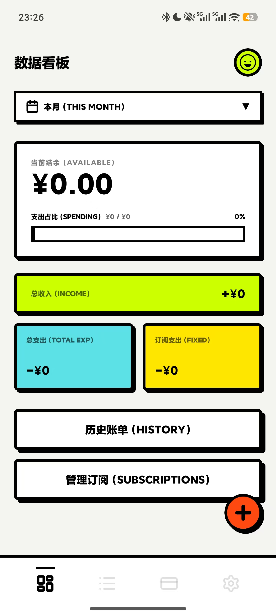
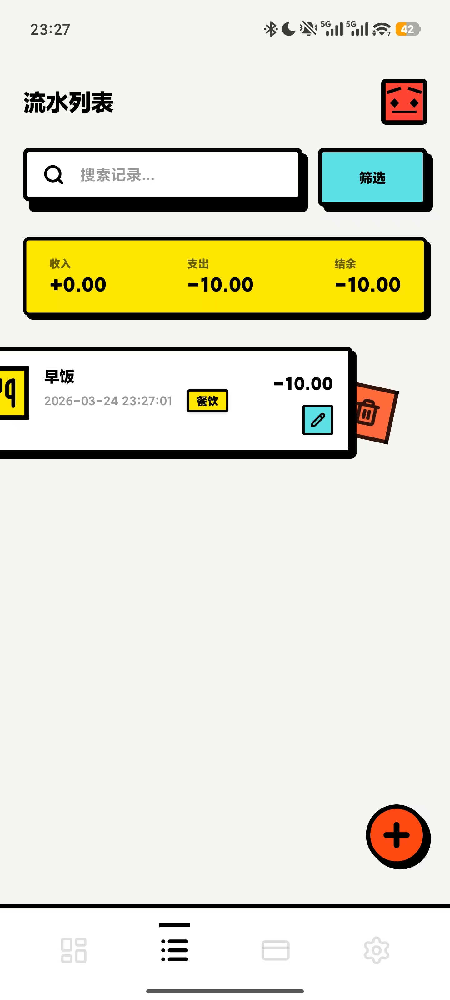
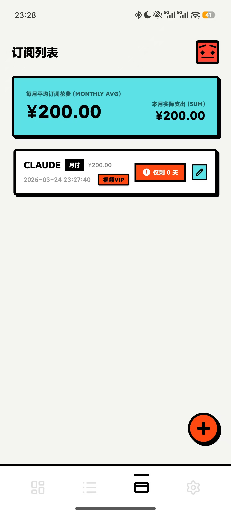
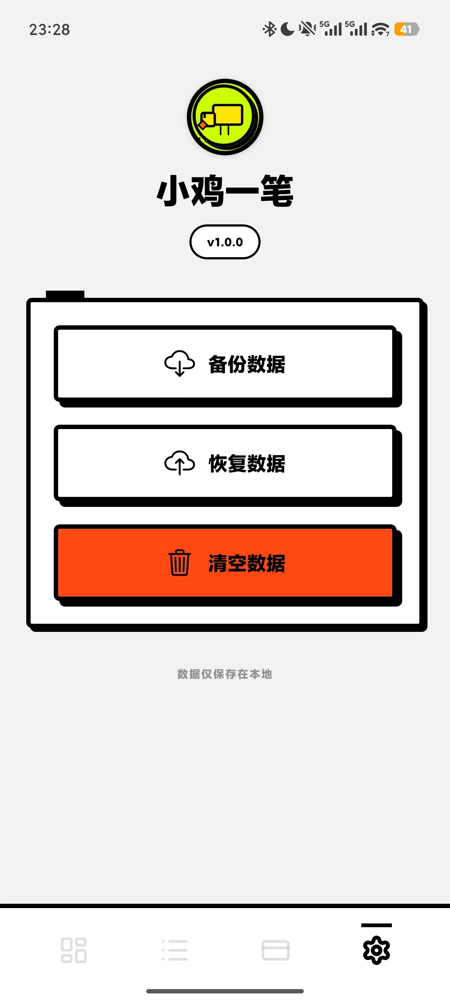

<div align="center">
  
  <h1>小鸡一笔 (CashFlow)</h1>
  <p><strong>Neo-Brutalism 风格的个人记账工具</strong></p>

  <p>
    
    
    
    
    
  </p>

  <p>
    <a href="#-核心特性">核心特性</a> •
    <a href="#-视觉灵魂">视觉灵魂</a> •
    <a href="#-本地运行">本地运行</a> •
    <a href="#-项目路线图">项目路线图</a>
  </p>
</div>

---

### 🌟 项目简介

**小鸡一笔 (CashFlow Vibe)** 是一款纯本地运行的个人记账与订阅管理工具。我们采用 **Neo-Brutalism (新粗野主义)** 视觉风格，打破传统财务软件的沉闷感，为你提供极简、高频且具有视觉冲击力的资金流转记录体验。

> [!IMPORTANT]
> **隐私承诺**：所有财务数据均存储在你的设备本地，不上传、不共享，保障绝对的隐私。

---

### 📱 应用截图

<div align="center">
  
  
  
  
</div>

---

### ✨ 核心特性

- **🎯 首页看板 (Dashboard)**
  - 核心指标一眼即达：可用结余、收入、支出、订阅。
  - 动态预算进度：粗边框进度条配合情绪化 Emoji。
- **💸 智能流水 (Transactions)**
  - 票根式筛选系统：按类别、日期交叉搜索。
  - 流畅手势：左滑删除、快速编辑。
- **📅 订阅官 (Subscriptions)**
  - 成本折算：年付/季付自动平摊至月度。
  - 到期预警：临近扣费红标提醒。
- **🛡️ 全局设置 (Settings)**
  - 导出/导入 JSON 备份，完全掌控数据命脉。

---

### 🎨 视觉灵魂

本项目严格遵循 **Neo-Brutalism** 设计法则：
- **色彩**：奶白背景 (#F4F4F0) + 荧光绿/亮黄点缀 + 纯黑边框。
- **边框**：所有组件均有 **4px** 极粗纯黑边框。
- **阴影**：**Hard Shadow** (4px/4px 纯黑不透明)，无羽化渐变。
- **排版**：几何感无衬线大号标题，数据展示极其强烈。

---

### 🛠️ 技术实现

- **核心框架**: React Native (Expo SDK 54)
- **状态管理**: Zustand
- **样式引擎**: NativeWind (Tailwind CSS)
- **数据库**: SQLite (Expo SQLite)
- **图标展示**: Lucide React Native
- **动效引擎**: React Native Reanimated
- **UI 设计**: 使用 **Pencil** 驱动，实现 100% Neo-Brutalism 设计还原

---

### 🚀 本地运行

```bash
# 1. 克隆项目
git clone https://github.com/your-username/CashFlow.git

# 2. 进入目录并安装依赖
cd CashFlow
npm install

# 3. 启动开发服务器
npx expo start -c | npm run start
```

---

### 📦 打包与发布

本项目使用 **EAS Build** 进行打包。

```bash
# 安装 EAS CLI
npm install -g eas-cli

# 生成 Android APK (预览版)
eas build -p android --profile preview

# 生成 Android App Bundle (生产版)
eas build -p android --profile production

# 生成 iOS 模拟器安装包
eas build -p ios --profile preview
```

---

### 🗺️ 项目路线图

- [x] 核心记账功能与本地数据库
- [x] 订阅管理与成本平摊
- [x] 数据导出/导入 (JSON)
- [ ] 分步交互式新手引导
- [ ] 更多视觉主题定制

---

### 🤝 参与贡献

如果你喜欢这个狂野的风格，欢迎提交 Issue 或 PR。

**Design & Code with ❤️ by Danniel & Antigravity**
